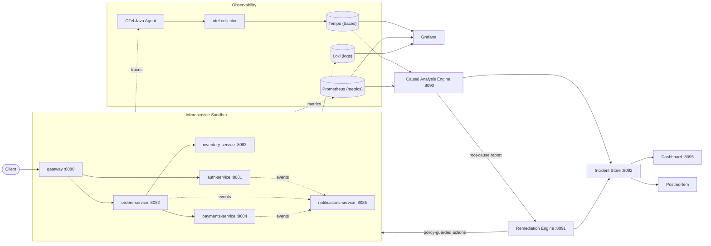
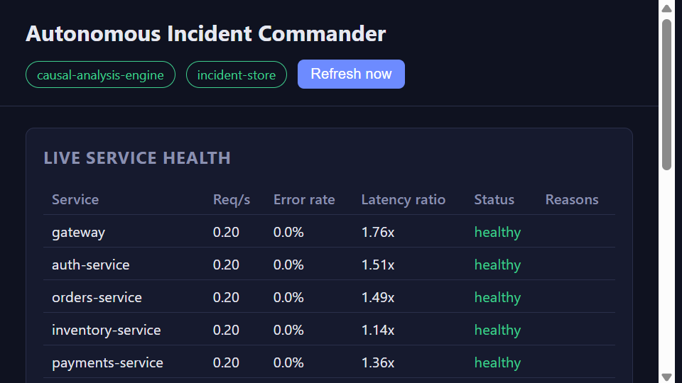
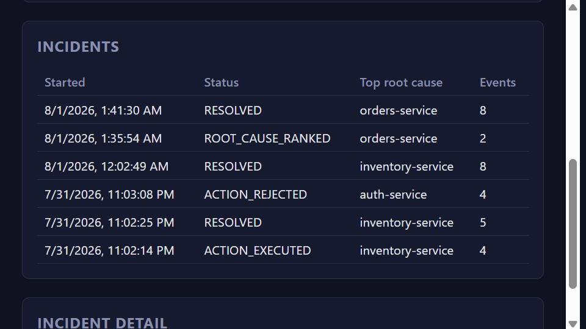
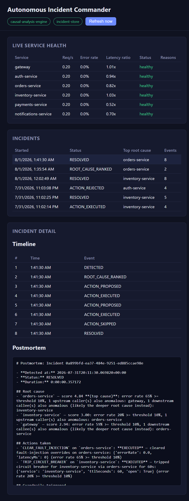

# Autonomous Incident Commander (AIC)

**A self-healing microservices sandbox that detects, diagnoses, and remediates production-style incidents — automatically, with zero cloud cost.**

[](LICENSE)
[](https://github.com/dheeraj313/autonomous-incident-commander/actions/workflows/ci.yml)
[](services)
[](services)
[](engine)
[](docker-compose.yml)
[](#running-locally)

Unlike a typical monitoring-dashboard project, AIC closes the **full SRE
loop** — **Observe → Diagnose → Decide → Act → Verify** — against a real,
containerized microservices stack:

1. **Detects** incidents from live telemetry (latency/error anomalies).
2. **Builds** a trace-derived service dependency graph and **ranks** the probable root cause.
3. **Executes policy-guarded auto-remediation** (restart, circuit-break, clear injected fault) with rate-limit, blast-radius, and human-approval guardrails.
4. **Records** every decision as an immutable event, so any incident can be **replayed** to explain *why* an action was taken, and auto-generates a markdown **postmortem**.

Everything runs locally via `docker compose` — no cloud account, no managed
services, $0 to run.

```powershell
git clone https://github.com/dheeraj313/autonomous-incident-commander.git
cd autonomous-incident-commander
.\demo.ps1
```

`demo.ps1` builds the stack, registers a demo user, generates traffic,
injects a real fault, watches the platform detect + auto-remediate it, and
prints the generated postmortem — one command, no manual `curl`s required.

## Table of contents

- [Why this exists](#why-this-exists)
- [Results](#results)
- [Architecture](#architecture)
- [Screenshots](#screenshots)
- [Features](#features)
- [Tech stack](#tech-stack)
- [Project structure](#project-structure)
- [Quick start](#quick-start)
- [API endpoints](#api-endpoints)
- [Testing](#testing)
- [Documentation](#documentation)
- [Engineering deep dive](#engineering-deep-dive)
- [Contributing](#contributing)
- [License](#license)

## Why this exists

Most portfolio "monitoring" projects stop at a Grafana dashboard. AIC goes
further: it's an opinionated demonstration of how an SRE platform can safely
**act** on what it observes, not just display it. Every decision is
guarded (rate limits, blast-radius caps, approval gates for disruptive
actions) and every action is auditable and replayable after the fact —
because "autonomous" without guardrails and an audit trail isn't something
you'd actually want running against production.

## Results

Measured against the live stack using the fault-injection scripts in
[`chaos/`](chaos/) (see [Testing](#testing) to reproduce):

| Metric | Result |
| --- | --- |
| Root-cause top-1 precision | **75%** (3/4 injected-fault scenarios correctly ranked #1) |
| Mean time to remediation (automated) | **~16s**, detection to executed mitigation |
| MTTR reduction vs. documented manual baseline | **97.8%** (16s vs. a 720s manual baseline: 6-service topology × diagnosis time + alert-ack + fix) |
| Automated test coverage | 27 pytest tests (3 Python engines) + JUnit/Mockito unit tests (6 Java services), all passing in CI |

See [`chaos/results/`](chaos/) for raw run output and the
["Engineering deep dive"](#engineering-deep-dive) section below for full
methodology and caveats (the manual-baseline number is a documented
assumption, not a measurement — there's no human on-call engineer in this
sandbox to time).

## Architecture



The **microservice sandbox** (top) is deliberately ordinary — a Java/Spring
Boot order-processing system instrumented the way a real production stack
would be. The **control plane** (Causal Analysis Engine → Remediation Engine
→ Incident Store) is the actual subject of this project: it observes the
sandbox purely through its telemetry (traces/metrics), the same way an
external SRE platform would, with no special hooks into the application code.

## Screenshots

Real screenshots taken from the dashboard (`http://localhost:8095`) against the live stack — not mockups.

**Live service health**, polled directly from the causal-analysis engine's `/anomalies` endpoint:



**Incident history**, each row a real, durably-persisted incident from the incident store:



**Incident detail**, showing the full replayable event timeline and the auto-generated postmortem for a resolved incident:



## Features

- 🔎 **Anomaly detection** — per-service error-rate/latency anomaly
  detection from live Prometheus metrics, comparing a recent window against
  a rolling baseline.
- 🕸️ **Trace-derived dependency graph & root-cause ranking** — mines real
  Tempo traces into a caller→callee graph and scores anomalous services
  higher when upstream callers are also anomalous (propagation), lower when
  downstream callees are anomalous (likely victim, not cause).
- 🤖 **Policy-guarded auto-remediation** — circuit-breaker trip, fault-
  injection rollback, or container restart, chosen deterministically from
  the root-cause signature — protected by a rate limiter, a blast-radius
  cap, and an approval workflow for disruptive actions.
- 📜 **Durable, replayable incident log** — every detection, ranking, and
  action is an immutable event in an append-only Postgres log; nothing is
  ever mutated, so any incident can be replayed exactly as it happened.
- 📝 **Auto-generated postmortems** — rendered directly from the event log,
  so the postmortem can never drift from what actually happened.
- 💥 **Chaos-validated** — fault-injection scripts measure real root-cause
  precision and MTTR reduction against the live stack, not simulated numbers.
- 🔐 **Admin-key auth** — every state-changing endpoint requires a shared-
  secret `X-Admin-Api-Key` header.
- ✅ **Real automated test coverage + CI** — pytest for all 3 Python
  engines, JUnit 5 + Mockito for all 6 Java services, run on every push/PR.
- 📊 **Read-only live dashboard** — a dependency-free HTML/CSS/JS page
  showing live service health and full incident timelines/postmortems.
- 🖥️ **One-command demo** — `.\demo.ps1` runs the entire incident lifecycle
  against the real stack, end to end.

## Tech stack

| Layer | Technology |
| --- | --- |
| Microservices | Java 17, Spring Boot 3 (Web, Data JPA, Kafka, Actuator/Micrometer) |
| Control-plane engines | Python 3.11, FastAPI, httpx, uvicorn |
| Messaging | Kafka (KRaft mode, no ZooKeeper) |
| Storage | PostgreSQL, Redis |
| Tracing | OpenTelemetry Java agent → otel-collector → Tempo |
| Metrics | Micrometer/Actuator → Prometheus |
| Logs | Docker stdout + Promtail → Loki |
| Visualization | Grafana, and a custom static dashboard (`dashboard/`) |
| Auth | Shared-secret `X-Admin-Api-Key` header on state-changing endpoints |
| Testing | pytest (Python), JUnit 5 + Mockito (Java) |
| CI | GitHub Actions |
| Orchestration | Docker Compose only — no cloud dependency, $0 cost |

## Project structure

```
autonomous-incident-commander/
├── docker-compose.yml
├── demo.ps1               # One-command end-to-end incident-lifecycle demo
├── infra/                 # Prometheus, Grafana, Loki, Promtail, Tempo, otel-collector, Postgres init
├── services/               # Java Spring Boot microservices (gateway, auth, orders, inventory, payments, notifications)
├── engine/                 # Python causal-analysis + remediation + incident-store/replay (each with a tests/ pytest suite)
├── dashboard/               # Static read-only web UI: live anomalies + incident history/postmortems
├── chaos/                  # Fault-injection scenarios used to validate MTTR/precision claims
├── .github/workflows/       # CI: Java build+test matrix + Python pytest matrix
└── docs/                   # Architecture notes, phase plan, postmortem samples
```

## Quick start

**Prerequisites:** Docker Desktop (with Compose v2), PowerShell.

```powershell
git clone https://github.com/dheeraj313/autonomous-incident-commander.git
cd autonomous-incident-commander
docker compose up -d --build
```

Or run the full guided demo in one command (builds the stack on first run
if needed, then walks through the entire incident lifecycle):

```powershell
.\demo.ps1
```

## API endpoints

| Service | URL | Notable endpoints |
| --- | --- | --- |
| Gateway | http://localhost:8080 | Reverse-proxies all sandbox services |
| Dashboard | http://localhost:8095 | Live anomalies + incident history/postmortems (read-only) |
| Grafana | http://localhost:3000 | admin/admin |
| Prometheus | http://localhost:9090 | Raw metrics |
| auth-service | http://localhost:8081 | `/api/auth/register`, `/api/auth/login` |
| orders-service | http://localhost:8082 | `/api/orders`, `/admin/circuit-breaker/{service}` |
| inventory-service | http://localhost:8083 | `/api/inventory/{item}` |
| payments-service | http://localhost:8084 | `/api/payments` |
| notifications-service | http://localhost:8085 | `/api/notifications?username=...` |
| Causal Analysis Engine | http://localhost:8090 | `/health`, `/dependency-graph`, `/anomalies`, `/root-cause` |
| Remediation Engine | http://localhost:8091 | `/health`, `/policies`, `POST /remediate`, `/actions`, `POST /actions/{id}/approve\|reject` |
| Incident Store | http://localhost:8092 | `/health`, `POST /incidents/start`, `/incidents`, `/incidents/{id}`, `/incidents/{id}/postmortem`, `POST /incidents/{id}/resolve` |

> State-changing endpoints above require an `X-Admin-Api-Key` header
> (default `dev-admin-key-change-me`, override via the `ADMIN_API_KEY` env
> var). Read-only `GET` endpoints are left unauthenticated so the dashboard
> can poll them directly from the browser.

## Testing

```powershell
# Python engines (pytest) - run from each engine's directory
cd engine/causal-analysis; python -m venv .venv; .\.venv\Scripts\pip install -q -r requirements-dev.txt; .\.venv\Scripts\python -m pytest -q

# Java services (JUnit 5 + Mockito) - no local JDK/Maven required, uses the
# same Maven image each service's Dockerfile builds with
docker run --rm -v "${PWD}/services/orders-service:/app" -v aic-maven-repo:/root/.m2 -w /app maven:3.9-eclipse-temurin-17 mvn -q -B test
```

CI (`.github/workflows/ci.yml`) runs both suites — a matrix build+test job
for all 6 Java services and a matrix `pytest` job for all 3 Python engines —
on every push and pull request to `main`.

## Documentation

See [docs/architecture.md](docs/architecture.md) for full design rationale,
including every bug found and fixed during live end-to-end validation.

## Engineering deep dive

The sections below document how the project was actually built, phase by
phase, including real bugs found during live validation (not just the
happy path). Click to expand.

1. ✅ **Foundation** – infra (Postgres/Redis/Kafka/observability stack) + gateway + auth-service + orders-service, telemetry flowing end-to-end.
2. ✅ **Fault injection** – toggleable latency/error injection (Redis-backed flag + admin REST endpoint) in every service.
3. ✅ **Full service chain + resilience** – inventory-service, payments-service, notifications-service; orders-service now orchestrates a saga-style order flow (reserve inventory → charge payment) guarded by a Redis-backed circuit breaker per downstream dependency.
4. ✅ **Causal analysis engine** – Python FastAPI service that mines Tempo traces into a service dependency graph, detects latency/error anomalies from Prometheus metrics, and ranks probable root causes.
5. ✅ **Remediation engine** – Python FastAPI service that turns a root-cause report into policy-guarded auto-remediation actions (circuit-break, clear fault injection, restart), with rate-limit/blast-radius guardrails and an approval workflow for disruptive actions.
6. ✅ **Incident event store** – Python FastAPI service that persists every detection/ranking/action decision as an append-only Postgres event log, exposes a replay-friendly timeline per incident, and auto-generates a markdown postmortem.
7. ✅ **Chaos scenarios** – host-side scripts that inject real faults, drive real traffic, and measure root-cause precision and MTTR reduction against the live stack.
8. ✅ **Hardening** – shared-secret admin-key auth on every state-changing endpoint, pytest suites for all 3 Python engines, JUnit/Mockito unit tests for all 6 Java services, GitHub Actions CI, a one-command `demo.ps1` script, and a read-only metrics/incidents dashboard UI.

<details>
<summary><strong>Phase 3 details — full service chain + resilience</strong></summary>

- **inventory-service** (`:8083`) – tracks stock per SKU (auto-provisions 1000 units for
  unseen SKUs so no catalog-seeding step is needed), decrements atomically under a
  pessimistic row lock on reserve, returns `409 Conflict` on insufficient stock, and
  publishes `inventory-events` to Kafka.
- **payments-service** (`:8084`) – charges an order (always succeeds — no real payment
  provider, this is a sandbox), persists a `payments` record, and publishes
  `payment-events` to Kafka.
- **notifications-service** (`:8085`) – consumes `auth-events`, `order-events`, and
  `payment-events` from Kafka and stores a per-user notification feed, exposed via
  `GET /api/notifications?username=...`. Fault injection on the consumer path drops
  (rather than crashes on) a message to simulate lagging/lost notifications during an
  incident.
- **Circuit breaker** (`orders-service`) – Redis-backed, per-downstream-service state
  (`circuit-breaker:{service}:open` / `:failures` keys with TTLs). Trips after N
  failures in a rolling window and fails fast (`*_SKIPPED_CIRCUIT_OPEN` order status)
  until the open-state TTL expires. Only infrastructure failures (timeouts, 5xx,
  connection errors) count against the breaker — a legitimate `409` "insufficient
  stock" response does not, since that's a business outcome, not a fault. Manual
  override via `POST/GET /admin/circuit-breaker/{service}`.
- **Saga note:** order creation is a simple, non-compensating saga — if payment fails
  after inventory has already been reserved, the reservation is *not* rolled back.
  This is a deliberate sandbox simplification (see `OrderService`), not a real-world
  recommendation.

</details>

<details>
<summary><strong>Phase 4 details — causal analysis engine</strong></summary>

- **causal-analysis-engine** (`:8090`, `engine/causal-analysis/`) – Python FastAPI
  service, no networkx/pandas dependency (graph logic is plain dicts/tuples):
  - `GET /dependency-graph` – mines recent Tempo traces into a caller→callee service
    graph (call count, error count, avg latency per edge). Only traces that pass
    through the gateway on a real (non-actuator) route are considered — an
    unfiltered "most recent N traces" search is dominated by Prometheus's ~15s
    `/actuator/prometheus` health-check scrapes on every service, which crowds out
    real business traffic almost entirely. See `config.DEPENDENCY_GRAPH_TRACEQL_FILTER`.
  - `GET /anomalies` – compares a short "recent" window against a longer "baseline"
    window (Prometheus `rate()` over `http_server_requests_seconds_{count,sum}`) per
    service for error rate and average latency; flags a service anomalous past
    configurable thresholds, gated by a minimum request rate to avoid flagging
    near-idle services on noise.
  - `GET /root-cause` – combines the two above: for each anomalous service, scores it
    higher if its upstream callers are also anomalous (propagation evidence) and lower
    if its downstream callees are also anomalous (evidence it's a victim, not the
    cause), then ranks descending.
  - Verified live end-to-end: injected a real fault into inventory-service
    (`POST /admin/fault-injection`, high error rate + latency) and confirmed
    `/root-cause` correctly ranked `inventory-service` #1, with `orders-service` and
    `gateway` ranked lower as propagation victims.

</details>

<details>
<summary><strong>Phase 5 details — remediation engine</strong></summary>

- **remediation-engine** (`:8091`, `engine/remediation/`) – Python FastAPI service,
  same lightweight dependency footprint (`fastapi`, `httpx`, `redis`, `docker`).
  Every action it takes is real (no simulated/no-op actions): it calls existing
  services' admin HTTP endpoints or the Docker API directly.
  - `POST /remediate` – fetches (or accepts an override) `root-cause` report from
    the causal-analysis engine, runs it through a deterministic policy engine, and
    executes or queues one action per anomalous service:
    - Elevated error rate on a service the circuit breaker already covers
      (`inventory-service`/`payments-service`) → `TRIP_CIRCUIT_BREAKER`, via
      orders-service's existing `POST /admin/circuit-breaker/{service}/trip`.
    - Elevated error rate elsewhere → `CLEAR_FAULT_INJECTION` (`DELETE
      /admin/fault-injection` on the offending service) — this sandbox has no real
      config-version history, so reverting an active fault-injection override
      stands in for a "config rollback" action.
    - Elevated latency only → `RESTART_SERVICE` (Docker API container restart).
  - **Guardrails:** a Redis-backed rate limit (max actions per service per rolling
    window, same TTL-counter pattern as the existing circuit breaker), a blast-radius
    cap (max distinct services touched per `/remediate` call — remaining ranked
    causes are reported back as skipped), and an approval gate: `RESTART_SERVICE` is
    disruptive (drops in-flight connections) so it's always created
    `PENDING_APPROVAL` instead of executing immediately; `POST
    /actions/{id}/approve` or `/reject` resolves it.
  - `GET /actions` — in-memory audit log of every action taken/pending this
    process (Phase 6's incident store persists this durably in Postgres).
  - Verified live end-to-end: real fault injected into inventory-service correctly
    triggered `TRIP_CIRCUIT_BREAKER` (confirmed the breaker was actually open via
    orders-service's status endpoint), a latency-only anomaly correctly queued a
    `PENDING_APPROVAL` restart, approving it restarted the real `notifications-service`
    container (confirmed via `docker ps` uptime reset), and repeating the same
    candidate 3+ times correctly tripped the per-service rate-limit guardrail.

</details>

<details>
<summary><strong>Phase 6 details — incident event store</strong></summary>

- **incident-store** (`:8092`, `engine/incident-store/`) – Python FastAPI service,
  `fastapi`/`httpx`/`asyncpg` only. Orchestrates Phases 4+5 into a durable,
  replayable incident lifecycle, backed by the append-only `incidents.incident_events`
  Postgres table (already scaffolded in Phase 1's `infra/postgres/init.sql`).
  - `POST /incidents/start` – fetches (or accepts an override) a root-cause report
    from causal-analysis-engine, persists `DETECTED`/`ROOT_CAUSE_RANKED` events, then
    passes that *exact same report* to remediation-engine's `/remediate` and persists
    an `ACTION_PROPOSED` event per action (plus `ACTION_EXECUTED`/`ACTION_FAILED` if it
    ran immediately, or `ACTION_SKIPPED` for guardrail-blocked/blast-radius-skipped
    candidates).
  - `POST /incidents/{id}/sync` – polls remediation-engine for each action's current
    status and appends a new event whenever it has changed (e.g. an approval or
    rejection that happened after `/incidents/start` returned) — this is how
    approve/reject decisions made later get reflected in the incident's timeline.
  - `GET /incidents/{id}` – the full ordered event list *is* the replay: nothing is
    ever mutated in place, so this is always a faithful reconstruction of exactly
    what was detected, decided, and done, in order.
  - `GET /incidents/{id}/postmortem` – renders that same event list into a markdown
    postmortem (root cause, actions taken, guardrails triggered, full timeline table,
    resolution status) — no separate/duplicated data source, purely a projection of
    the event log.
  - `POST /incidents/{id}/resolve` – appends a terminal `RESOLVED` event (kept
    manual/explicit rather than auto-inferred, consistent with this project's
    approval-first philosophy for anything that closes out an incident).
  - Unlike remediation-engine's in-memory audit log, every event here is genuinely
    durable: **verified live** by restarting the `incident-store` container mid-test
    and confirming `GET /incidents/{id}` still returned the complete, correctly
    ordered event history afterward.
  - Verified live end-to-end: a synthetic root-cause report for inventory-service
    correctly produced `DETECTED` -> `ROOT_CAUSE_RANKED` -> `ACTION_PROPOSED` ->
    `ACTION_EXECUTED` events for an auto-approved `TRIP_CIRCUIT_BREAKER`; a second
    incident for auth-service correctly stayed at `ACTION_PROPOSED` (`PENDING_APPROVAL`)
    until the action was rejected out-of-band via remediation-engine directly, at
    which point `POST /incidents/{id}/sync` correctly detected the transition and
    appended a new `ACTION_REJECTED` event; `/postmortem` and `/resolve` both
    verified correct against the resolved circuit-breaker incident.

</details>

<details>
<summary><strong>Phase 7 details — chaos scenarios & measured results</strong></summary>

- **chaos/** – plain Python scripts (no container, run from the host against the
  exposed `localhost` ports), `pip install -r chaos/requirements.txt` (just `httpx`).
  Run everything with `python chaos/run_all.py`, or the two experiments individually:
  - `python chaos/precision_experiment.py` – runs 4 fault scenarios (`chaos/scenarios.py`:
    inventory error burst, payments error burst, auth latency spike, orders latency
    spike) against the live stack. Each scenario clears prior faults, waits out a
    cooldown, injects a real fault via the target service's `/admin/fault-injection`,
    drives real traffic through the gateway, and polls causal-analysis-engine's
    `/root-cause` until it reports an incident — then checks whether the #1 ranked
    cause matches the service the fault was actually injected into. Results (raw JSON)
    are written to `chaos/results/`.
  - `python chaos/mttr_experiment.py` – injects a real error burst into
    inventory-service, drives traffic, and repeatedly calls incident-store's live
    `POST /incidents/start` until an action is executed and confirmed (circuit breaker
    actually open). That measured, fully-automated time is compared against a
    documented **manual-baseline assumption** (alert ack + per-service diagnosis time
    × the *actual* live dependency-graph size + fix execution — see `chaos/config.py`
    for the named constants) — there's no real human in this sandbox to time, so the
    manual baseline is an explicit, adjustable assumption, not a measurement.
  - **Measured results (latest run):** root-cause top-1 precision **75%** (3/4
    scenarios correctly identified the injected service as the #1 cause; the one miss
    was a genuine early-detection timing artifact — see "bugs found" in
    [docs/architecture.md](docs/architecture.md) — not a ranking defect, confirmed by
    directly inspecting `/anomalies` and seeing the correct service become anomalous
    within a couple of seconds of the one that was reported first). MTTR: automated
    detection-to-mitigation in **~16s** vs. a documented manual baseline of **720s**
    (6-service topology × 90s/service diagnosis + 120s alert-ack + 60s fix), a
    **97.8%** reduction against that documented assumption.
  - Two real bugs were found and fixed during live validation of this phase — see
    [docs/architecture.md](docs/architecture.md) Phase 7 section for details.

</details>

<details>
<summary><strong>Phase 8 details — hardening: auth, tests, CI, demo, dashboard</strong></summary>

- **Admin-key auth** – every state-changing endpoint (fault injection,
  circuit-breaker trip, remediate/start, action approve/reject, incident
  resolve) requires an `X-Admin-Api-Key` header, checked against the
  `ADMIN_API_KEY` env var (default `dev-admin-key-change-me`). This is a
  minimal shared-secret guard, not a real auth system (no users/roles/token
  expiry) — enough that the stack isn't wide open with ports published to
  the host. Read-only `GET` endpoints stay unauthenticated so the dashboard
  can poll them straight from the browser. Implemented via a shared
  `AdminAuthFilter` in each Java service and a `require_admin_key` FastAPI
  dependency in each Python engine.
- **Tests + CI** – each Python engine has a `tests/` pytest suite (27 tests
  total) covering policy/guardrail logic, anomaly detection, root-cause
  ranking, and postmortem rendering. Each of the 6 Java services also has its
  own `src/test/java` unit test suite (JUnit 5 + Mockito, all collaborators
  mocked — no Testcontainers/embedded DB/Kafka/Redis needed), covering
  service-layer business logic, circuit breakers, event publishing, and the
  `AdminAuthFilter` admin-key guard. `.github/workflows/ci.yml` runs on every
  push/PR: a matrix build+test of all 6 Java services (`mvn package`, which
  runs the unit tests) and a matrix `pytest` run for all 3 Python engines.
- **`demo.ps1`** – one-command PowerShell script that runs the full incident
  lifecycle against the real stack: starts the stack, waits for core
  services to report healthy, registers/logs in a demo user, generates
  baseline traffic, injects a real fault into inventory-service, drives
  load, detects + remediates the incident, prints the generated postmortem,
  and cleans up the fault. Run it with `.\demo.ps1` — builds the stack
  itself on first run, and intentionally doesn't force-rebuild on later runs.
- **Dashboard** (`dashboard/`, http://localhost:8095) – a static, dependency-
  free HTML/CSS/vanilla-JS page (its own small nginx container) that polls
  causal-analysis-engine's and incident-store's read-only endpoints to show
  live per-service anomaly status, connection-status indicators, a list of
  historical incidents, and — on selecting one — its full event timeline and
  rendered postmortem. Never needs the admin key since it only reads.
- Verified live end-to-end: a full `demo.ps1` run completed with zero
  unexpected `401`s and correctly executed remediation actions — see
  [docs/architecture.md](docs/architecture.md) Phase 8 section for the two
  infrastructure bugs and one auth-header regression found and fixed during
  this validation.

</details>

## Contributing

This started as a portfolio/learning project but issues and PRs are
welcome — bug reports, additional chaos scenarios, more remediation
policies, or dashboard improvements are all fair game. Please open an issue
first for anything beyond a small fix so it can be discussed before you
invest time in a PR.

## License

Released under the [MIT License](LICENSE).

